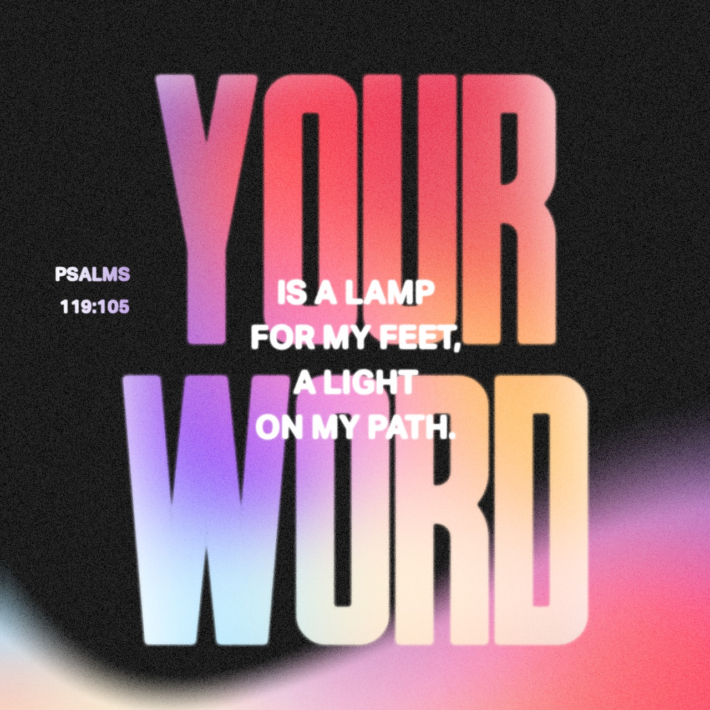

import { YouTube } from 'astro-embed';

There is this verse in Psalm 119 that motivates me again and again:

God lights us the way, so we don't stand in the dark.

Until now, reading this verse I always pictured a bright light or something like a flashlight.

The lamps that were used back then were nothing more than small candles.

There were moments in my life when I no longer knew how or where to go next.

There were moments in my life, when I couldn't see anything but smoke around me. Smoke from the fires that burned all my plans, dreams and hopes down.

In moments like these, God gives hope from the situation, not as a floodlight that can light up the next small town, but as small candles of hope that lead me out of this place of hopelessness - out of the smoke.

In moments like these, God gives me a perspective - even though I don't know the plan - even if [everything around me burns down, I won't burn out](https://blog.jesusfreakhideout.com/2021/08/what-burns-down-doesnt-burn-out-by-sam-bowman/).

<YouTube id="j3hV_XHOpkE" />

God gives me hope in all of this, he lights me the way, he ignites my heart and as long as my heart burns for him, it doesn't matter how big the flame is - how far I can see - I will arrive at my destination.