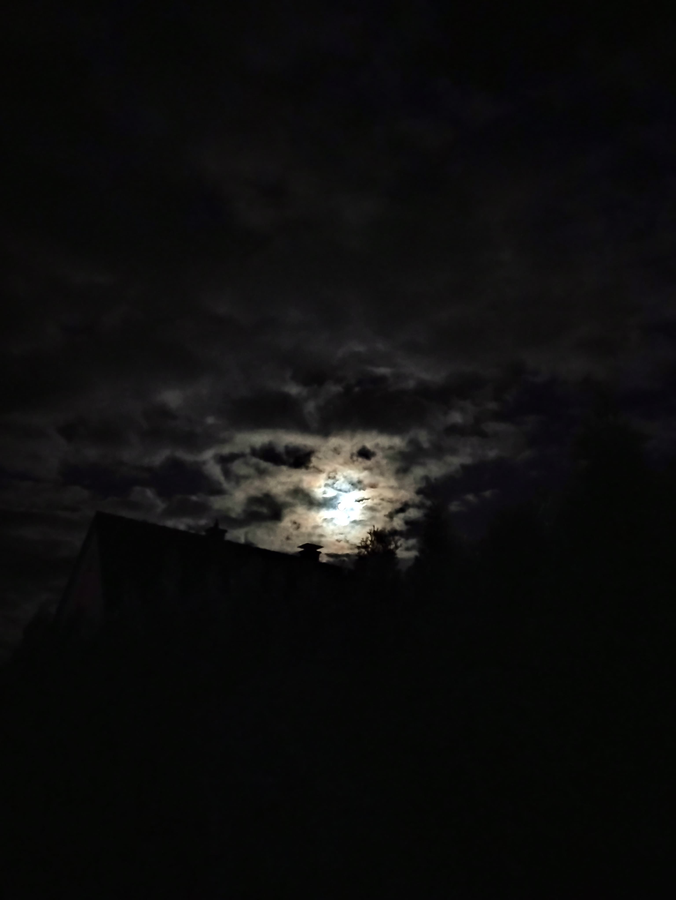
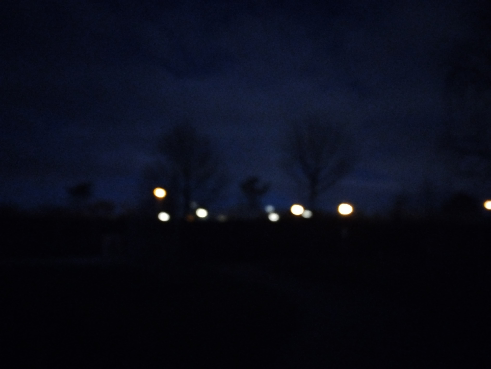

A picture is is worth a thousand words.

A thousand images pass before my eyes every day.

Mindlessly, almost automatically, my fingers double-click - like - and scroll.

When I venture my feet outside the door of my digital presence, my gaze remains on the place where I feel so at home.

I go through my life sharing selfies and photos of my food.

A picture is worth a thousand words. *I am surrounded by silence.*

On my evening walk - with my headphones on - I only lift my eyes to take a photo of the moon.

I wonder why the moon never looks as beautiful in photos as it does in real life.

God makes the moon shine, an image that should speak to me. An image that I should enjoy.

An image that shouldn't be part of this *double-click - like - and scroll* cycle.

A picture is worth a thousand words.

The question is, do I let it speak to me?
