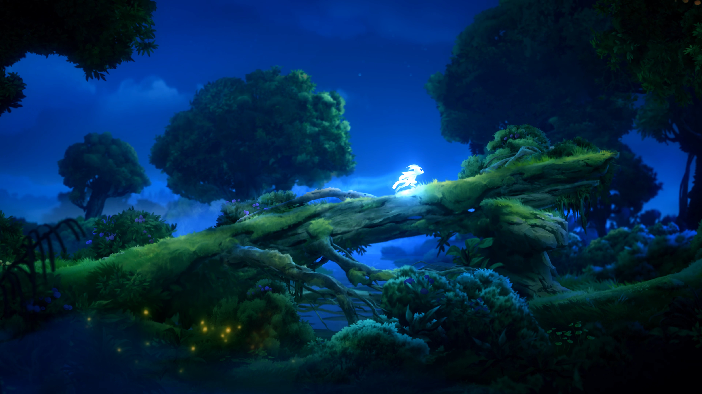

import { Image } from 'astro:assets'

I think it is important to know what brings you joy.

You should at have at least one thing that you can remember as a little bright spot, when otherwise the lights turn off.

### Gaming
I would call myself a Gamer. I don't play most games competitively but I enjoy the occasional round Mario Kart or Mario Party.

For years I didn't really really play anything.
But last year I've got a Nintendo Switch and Hollow Knight for Christmas - since then I've been a real Gamer™.

I really enjoy discovering beautifully crafted worlds and piecing together lore while listening to great soundtracks.

Only recently I got myself [Ori and the Will of the Wisps](https://www.orithegame.com) and it has been a blast! 
The loading times on the Switch are kind of bad but that's what I got myself into by getting a Switch. 🤷‍♂️

What I've been enjoying as of late as well are the [Jackbox Party Packs](https://jackboxgames.com/).
A Jackbox Party Pack consists of 5 different games that can each be played using your phone as a controller. The concepts are rather simple - they kind of have to - you play on a smartphone after all.
The thing that I really enjoy with the Jackbox Games is for one the dumb humor and the beautifully crafted art style.

Each and every one of the games is really beautiful.

### Music
As I write this post, I'm listening to something. You've guessed it: It's music. (Well, that wasn't that difficult...)

Music has always been a place of retreat for me. I can't think of a time where I didn't listen to music.
I'm not that musically inclined, but I still tend to overanalyze everything I hear. 😅

I enjoy music that makes me feel things, when I'm sad, I mostly listen to sad songs.
I also pay attention to the lyrics most of the time.

Music is calming, thought-provoking and 

I mostly listen to [NF](https://youtu.be/vhumOLNSSJY) or the [Sam Bowman](https://youtu.be/QnKRK5HUjJQ), [JSteph](https://youtu.be/Loa1v_pnH6s), [Matthew Parker](https://youtu.be/HvSvaS1_Q4s) Trio. (Not really an official trio, but I feel like they do much together, so...)

## Photography
I enjoy photography. I enjoy looking at beatiful landscapes just as much as I enjoy taking photos of them.
I'm not that good at taking photos with people in them but taking photos of nature, buildings and the world around me fills me with joy.

Capturing this piece of peace. Photos are time capsules that convey not just the situation they grew out of but emotions, feelings, thoughts.

## Wrap up
Okay, this was a long post, I'm sorry.
I am going to stop now, but I just had to write that down. I find it incredibly important to know what brings you joy, just as a reminder for the darker days.

If you happen to have one of those days right now, remember: There is always someone who loves you, someone who knows you. Even if you don't happen to know him.

> Every heartbeat is a reason for tryin'  
> Every exhale is anxiety dyin'  
> Take another step through the open door  
> We could be so much more  
> What are we waitin' for?  
> ~ [Matthew Parker - Exhale](https://youtu.be/8Xr2OKe_4S0)

There's always a reason. ❤️